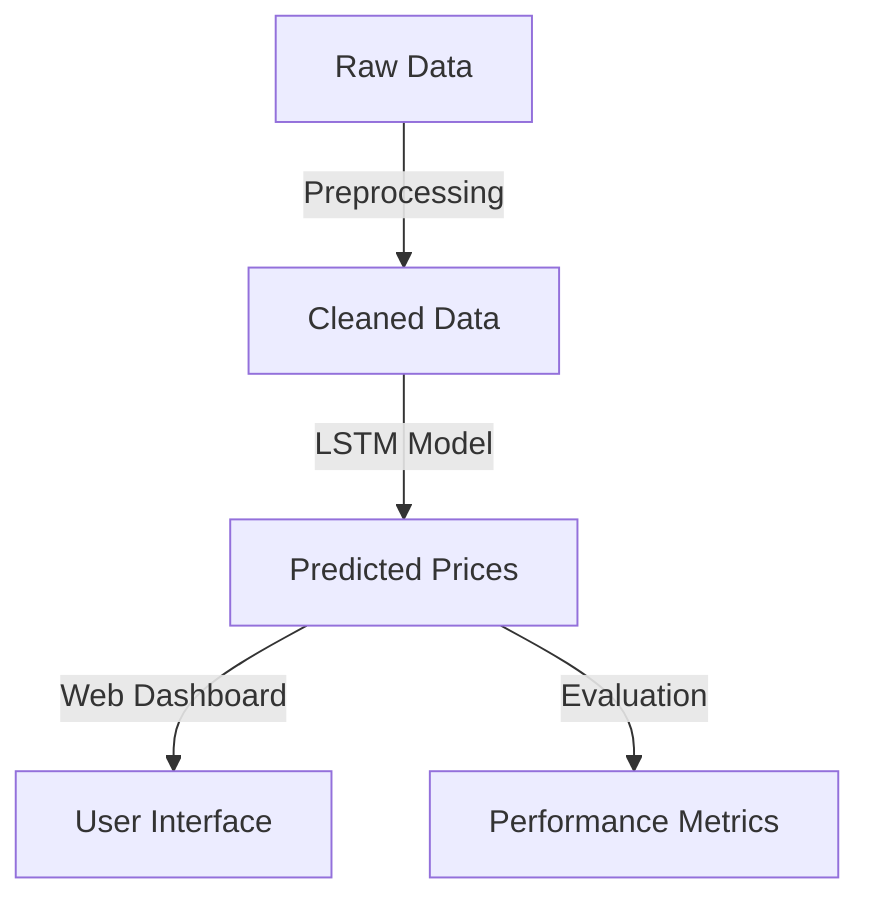

# 🚀 Cryptocurrency Price Prediction using LSTM Neural Networks

  
*A project to predict cryptocurrency prices using LSTM & Twitter Sentiment Analysis*

  
  
  

---

## 📌 **Project Overview**
This project utilizes **Long Short-Term Memory (LSTM)** neural networks to predict cryptocurrency prices (**Bitcoin, Ethereum, Ripple**). The model captures **temporal patterns** in time-series data, tackling the high volatility of the crypto market.  

### **🔹 Model Performance**
📈 **Mean Absolute Error (MAE):**  
✅ **Bitcoin** - **2.42%**  
✅ **Ethereum** - **4.19%**  
✅ **Ripple** - **5.88%**  

---

## 🔍 **Key Features**
✅ **📊 Data Preprocessing:** Cleaned & normalized historical price data for effective model learning.  
✅ **💬 Twitter Sentiment Analysis:** Used **RoBERTa**, a transformer model, to classify tweets as **positive, neutral, or negative**, improving predictions.  
✅ **🌐 Web Application:** Built a **Flask-based dashboard** for real-time crypto price forecasting.  

---

## 🏗 **Project Architecture**

---
